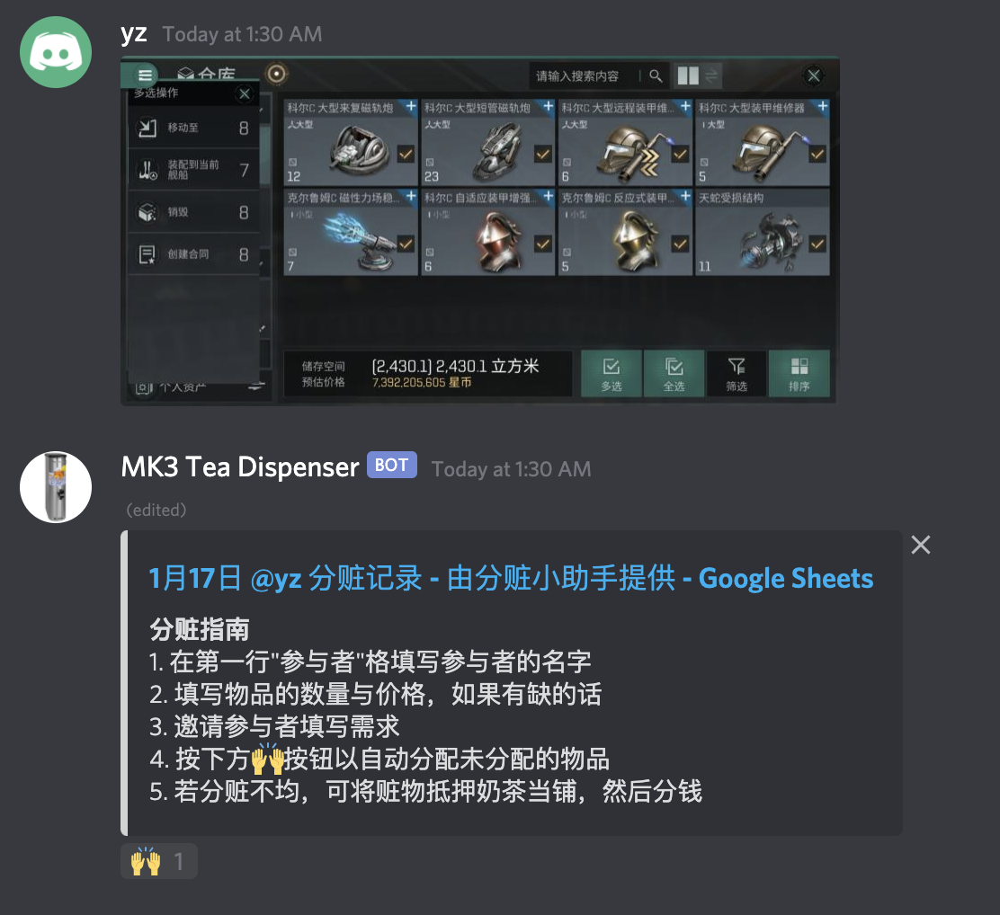
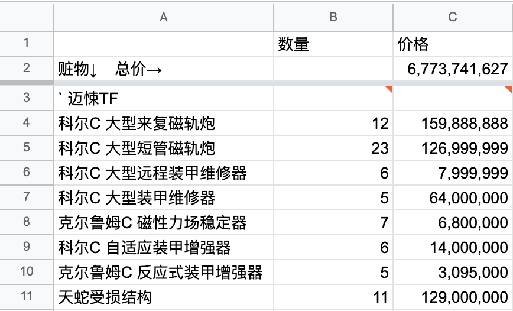
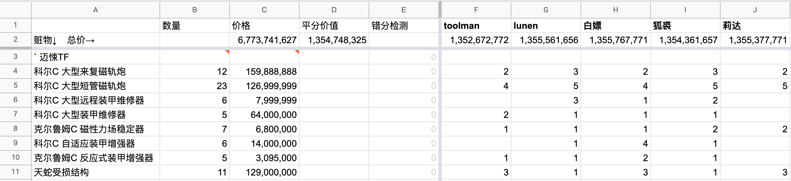
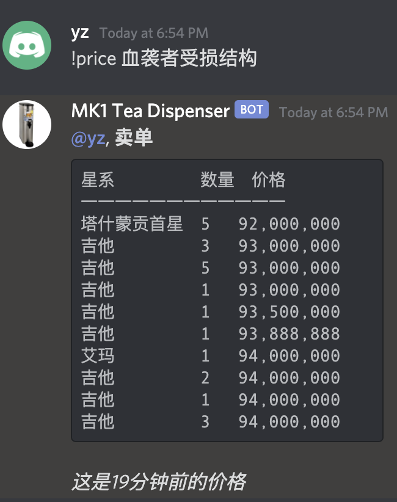
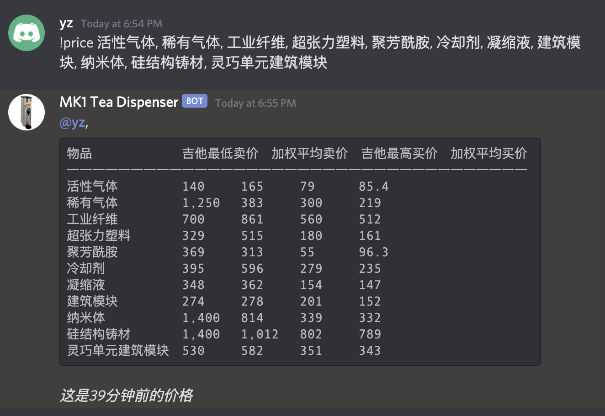

# TEA E-accounting Assistant

A Discord bot to make loot accounting easier for Eve Echoes corps. Made by TEA.

## Overview

### OCR and Auto Price Lookup

Post a screenshot, and get the list of loots in a spreadsheet. 





Note: Chinese text only, for now.

### Split Loots in One Click



### Market Price Lookup



Note: The bot supports a limited set of items, specifically those obtainable in Delve and Fountain, such as laser modules, blueprints, and materials.

### Batch Price Lookup



### TODO

- [ ] OCR in English.
- [ ] User interface in English.

## Try Our Instance

[Discord Bot Invitation](https://discord.com/oauth2/authorize?client_id=776233216793116683&scope=bot)

Note: the bot currently speaks Chinese only.

<h3 id="permissions-source">
Permissions
</h3>

The bot will react to new images in every channel it can view. 
To make it less noisy, the bot should view and only view one text channel, 
where folks will post their screenshots.

## Installation

Alternatively, you may run your own instance of the bot. 
This approach is good for:

- Heavy usage: Our bot is running on a resource constrained server. However, it will be easy to scale your own server.
- Privacy: We will not have access to your data.
- Developers: You may want to run and test the bot.

### Minimum System Requirement

Memory: 2G.

### Setup External Services

The bot uses Discord and Google Sheets APIs, both of which need setup:

- [Setting up a bot application](https://discordjs.guide/preparations/setting-up-a-bot-application.html#creating-your-bot).
- [Create a service account](https://support.google.com/a/answer/7378726?hl=en). Note: You may skip the Step 2 and 3. 

### Start the Bot

```bash
yarn
DISCORD_BOT_TOKEN=[DISCORD_BOT_TOKEN] GOOGLE_APIS_CREDS=[GOOGLE_APIS_CREDS] yarn start
```

where `[DISCORD_BOT_TOKEN]` is the token of your bot set up above, 
and `[GOOGLE_APIS_CREDS]` is the private key JSON data of the service account created above.

### Invite Your Bot

Visit the link `https://discord.com/oauth2/authorize?client_id=[CLIENT_ID]&scope=bot`
where `[CLIENT_ID]` is the client ID of your bot application created above.

The bot also needs permissions. See [above](#permissions-source).

## Usage

1. Enter a Discord channel the bot can view. 
1. Post a screenshot of items selected in the inventory.
1. Follow the bot's instructions.
