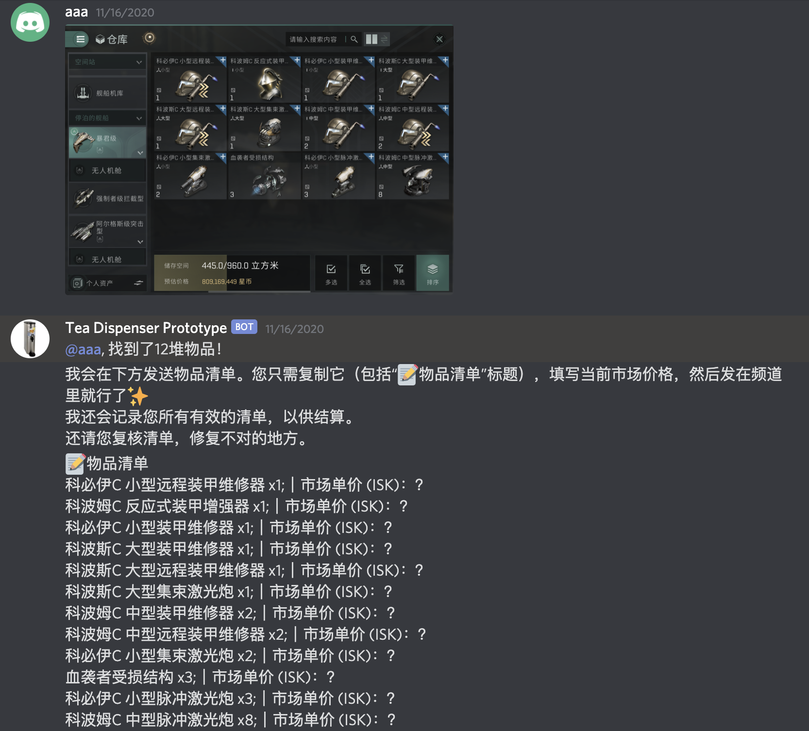
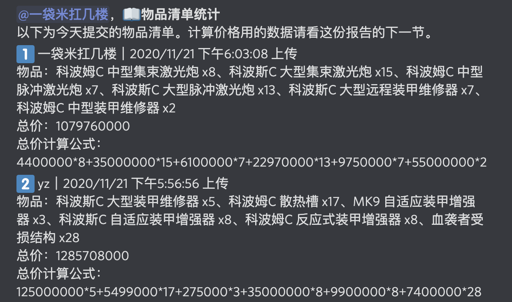
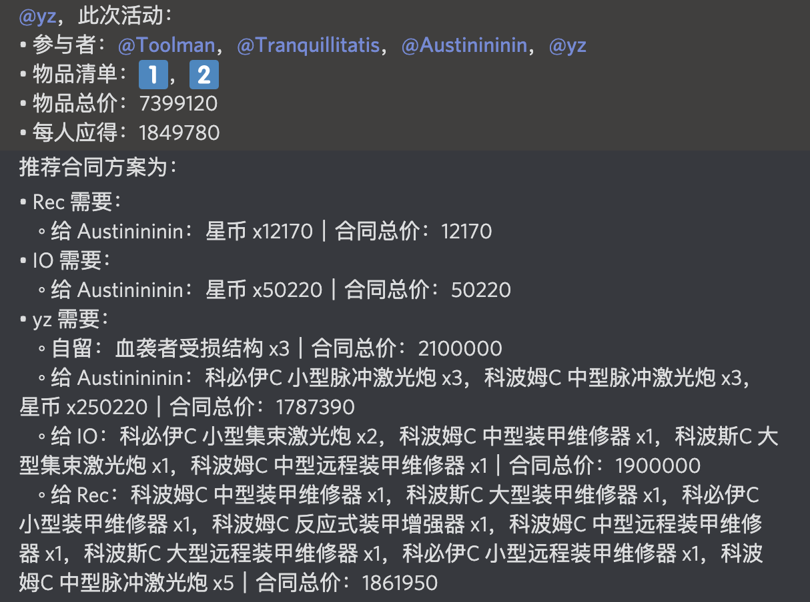

# TEA E-accounting Assistant

A prototype system to make loot accounting easier for Eve Echoes corps. Made by TEA.

Not production ready.

## Features Preview

### Detect Items from Image

### Keep Records

### Settle Up with Participants

## TODO

- [ ] Automatically pull price from in-game market.
